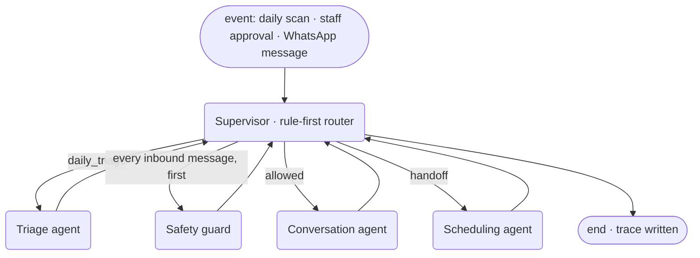

# RecallCare

> **Synthetic data only.** Every patient, phone number and clinic in this repository is fictional ("Sunbird Family Dental" does not exist). No real patient data is used anywhere, and RecallCare never gives clinical advice.

**RecallCare is a team of AI agents that finds every patient who has fallen behind on dental care, reaches them on WhatsApp in their own language, books them back in, and hands anything clinical or sensitive to a human, with every decision traceable.**

Built by team **Binary Beasts** (team code K2EZYJRZ, Public category) for the NUS-ISS *Show Me Your Agents* hackathon (powered by AWS, supported by the Singapore Business Federation). Official SME problem statement: *Patient Follow-up* for dental clinics.

---

## What it does

1. **Daily triage** — scans the recall schedule, scores who is overdue with a transparent rule-based score, and proposes today's outreach batch with a plain-English reason per patient.
2. **Staff approval (Tier 2)** — clinic staff approve, remove or edit the batch in one click.
3. **Outreach** — an approved WhatsApp *template* in the patient's language (English, 中文, Bahasa Melayu, தமிழ்).
4. **Conversation** — once the patient replies (24-hour window open), agents answer logistics from the clinic info sheet, offer real free slots and book.
5. **Escalation (Tier 3)** — symptoms, complaints, billing, requests for a human, prompt-injection, impersonation or anything uncertain go to a person with an English summary; the patient gets a warm holding reply ("…if this is an emergency, call 995").
6. **Follow-through** — booking confirmations, exactly one gentle re-nudge for non-responders, opt-outs honoured immediately and permanently.

## Architecture



* **LangGraph** `StateGraph` with a typed state, a supervisor node with conditional edges, and a SQLite checkpointer (short-term memory per patient thread). Long-term memory is a per-patient follow-up state machine in SQLite (`due → proposed → approved → contacted → replied → booked | declined | escalated | opted_out | no_response`).
* **Least privilege**: each agent can call only its own tools; patient-scoped tools are hard-scoped in code (see `app/tools/registry.py`). Only the scheduling agent can write to the calendar, and only slots it offered to *this* patient.
* **JSON tool protocol**: the organisers' gateway has unreliable native tool calling, so every agent replies with one JSON object that we parse and validate with Pydantic, with one repair prompt and escalation on a second failure (`app/llm/protocol.py`).
* **Deterministic where it can be**: overdue scoring, slot search, the guard's 4-language pre-screen, opt-out handling and every safety-critical message (holding replies, slot offers, confirmations) are code, not model output. The model does language work only.
* **One path to a patient** (`app/core/messaging.py`): output validator → consent/opt-out → Tier-2 hold for sensitive patients → 24h-window check → channel adapter (allowlist enforced again).

Full detail: [`docs/architecture.md`](docs/architecture.md) and the technical document in [`docs/`](docs/).

## Quick start (zero credentials)

Requires Python 3.11+.

```bash
make install     # venv + pinned dependencies
make demo        # mock LLM + in-app phone simulator → http://127.0.0.1:8000  (login: staff / demo)
```

In the dashboard press **Run demo scenario**, approve the batch, open **Patient phone** and reply as Mdm Tan (quick-reply chips are provided). Then:

```bash
make test        # 66 unit/integration tests (mock LLM, simulator channel)
make eval        # 36 eval scenarios in mock mode (free, deterministic)
```

## Configuration

Copy `.env.example` to `.env` (gitignored). Every variable is documented there; the important ones:

| Variable | Purpose | Default |
|---|---|---|
| `LLM_PROVIDER` | `mock` \| `gateway` \| `openrouter` | `mock` |
| `LLM_GATEWAY_URL`, `LLM_GATEWAY_API_KEY`, `LLM_MODEL` | Organisers' Bedrock-backed gateway (names match the official starter kit) | kit URL / Claude Sonnet 4.5 |
| `OPENROUTER_API_KEY`, `OPENROUTER_MODEL` | Fallback provider (used after two gateway failures) | `anthropic/claude-haiku-4.5` |
| `LLM_MAX_REQUEST_BYTES` | Hard cap per request (gateway WAF rejects > ~8 KiB) | `7500` |
| `LLM_GATEWAY_API_STYLE` | Gateway wire format: `ollama` (`/api/chat`) or `openai` (`/v1/chat/completions`) | `ollama` |
| `LLM_TOKEN_BUDGET_DAILY`, `LLM_TOKEN_BUDGET_TOTAL` | **Hard spend cap** (set from the organisers' usage plan); at the cap agents fall back to rules + staff | `500000`, `3000000` |
| `CHANNEL` | `simulator` \| `whatsapp` (also switchable live in the dashboard) | `simulator` |
| `WHATSAPP_ALLOWLIST` | Comma-separated E.164 numbers. **The adapter refuses any other number.** | empty |
| `DEMO_PHONE_MAP` | `patient_id:+65…` pairs linking demo patients to real allowlisted phones | empty |
| `WHATSAPP_ACCESS_TOKEN`, `WHATSAPP_PHONE_NUMBER_ID`, `WHATSAPP_GRAPH_VERSION` | Meta WhatsApp Cloud API (version from Meta's API Setup page, never hard-coded) | empty |
| `WHATSAPP_APP_SECRET`, `WHATSAPP_VERIFY_TOKEN` | Webhook signature check (`X-Hub-Signature-256`) and GET verification | empty |
| `WHATSAPP_TEMPLATE_NAME`, `WHATSAPP_TEMPLATE_APPROVED` | Custom template; until approved, Meta's `hello_world` is used on the real channel | `recall_reminder`, `false` |
| `DASHBOARD_USER`, `DASHBOARD_PASSWORD`, `SESSION_SECRET` | Staff login (the dashboard shows patient data, even synthetic) | `staff`, random |
| `AUTO_JOBS` | Morning triage scan + hourly single re-nudge within sending hours | `true` |
| `AS_OF_DATE` | Freeze "today" for repeatable demos | real date (SGT) |

All clinic-specific rules (recall intervals, urgency weights, opening hours, info sheet, keyword lists in 4 languages, staff-time assumptions) live in [`config/clinics/dental.yaml`](config/clinics/dental.yaml). Clinical intervals there are **illustrative and configurable by the clinic**, not medical guidance.

## Evals

```bash
python -m evals.run --mode mock      # free, deterministic, used in CI
python -m evals.run --mode live      # real model via the gateway/OpenRouter (costs tokens; run sparingly)
```

14 golden-path scenarios and 22 adversarial ones (prompt injection in all four languages, role-play jailbreaks, hidden symptoms, other patients' data, fake staff authority, opt-outs in every language, abuse, 20-slot booking attempts, emoji/gibberish, oversized messages, requests to message other numbers, tag break-outs). Safety invariants are checked on **every** scenario. Output: `evals/report.md`, `evals/report.json`, per-scenario traces viewable at `/evals` in the dashboard.

## Deployment (one Amazon Lightsail instance, medium)

systemd + Caddy (automatic HTTPS on `<ip-with-dashes>.sslip.io`), SQLite on disk.

```bash
# DEPLOY_HOST=<static IP> in .env, public key .secrets/lightsail_rsa.pub uploaded when creating the instance
deploy/deploy.sh
```

It syncs the code, writes the server `.env`, installs Caddy + a venv, installs the `recallcare` systemd unit and checks `https://<host>/healthz`. Point Meta's webhook at `https://<host>/webhook/whatsapp`.

## Repository map

| Path | What |
|---|---|
| `app/graph.py` | LangGraph state, supervisor, conditional edges, checkpointer |
| `app/agents/` | triage, guard, conversation, scheduling agents |
| `app/tools/` | Pydantic tool schemas + least-privilege registry |
| `app/llm/` | adapter: gateway, OpenRouter, mock, fallback; JSON protocol + repair |
| `app/channels/` | WhatsApp Cloud API + simulator adapters (allowlist enforced in both) |
| `app/core/` | deterministic core: scoring, slots, rules, validator, memory, messaging, metrics |
| `app/prompts/` | agent prompts (compact — the gateway WAF caps request size) |
| `app/web/` | dashboard templates, CSS, JS (no build step) |
| `evals/` | scenarios (YAML), runner, reports |
| `config/` | clinic config, WhatsApp templates (4 languages), deterministic message texts |
| `deploy/` | systemd unit, Caddyfile, server setup, deploy script |
| `docs/` | business proposal and technical document (Markdown sources + PDFs), architecture, generated fragments, deployment evidence |


## Licence

MIT — see [`LICENSE`](LICENSE). Built with the help of Claude Code (AI pair-programmer); see commit trailers.
