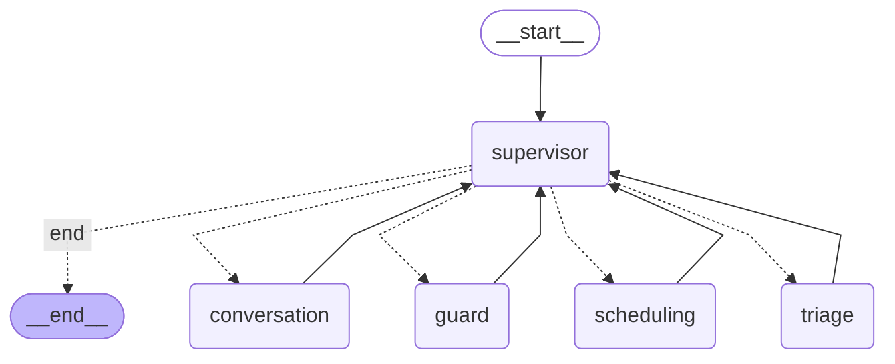

# RecallCare architecture

## LangGraph (generated by `make graph`, i.e. `graph.get_graph().draw_mermaid()`)

Dotted edges are the supervisor's **conditional edges**; every specialist returns to the supervisor. Specialists never talk to each other directly: they write typed hand-off fields into the shared state (`pending_scheduling`, `scheduling_result`, `escalation_request`) and the supervisor routes on them.

## Supervisor routing (rule-first, no LLM) — `app/graph.py::_decide`

| Event | Route |
|---|---|
| `daily_triage` | → triage → end |
| `outreach` / `renudge` (after staff approval) | → conversation (template) → end |
| `inbound_message` | → **guard first, always** → if blocked: end · else conversation → (scheduling → conversation renders result) → end |
| any `escalation_request` | → guard (owner of `escalate_to_staff`) → end |
| `step_count > 8` | → guard with `loop_limit` escalation → end |

## Agents and least privilege — `app/tools/registry.py::AGENT_TOOLS`

| Agent | Tools | Model use |
|---|---|---|
| Supervisor | none (routing only) | none |
| Triage | `list_patients_due` (read), `get_patient_summary` (read), `propose_batch` | 1 call/day: staff-facing reasons only; ranking is deterministic and the model cannot change batch membership |
| Safety guard | `escalate_to_staff`, `record_opt_out` | only when the deterministic pre-screen is inconclusive; can raise severity, never clear a keyword hit |
| Conversation | `get_clinic_info` (read), `get_own_patient_context` (read, hard-scoped), `request_scheduling`, `send_message` | logistics + intent; safety texts, slot offers and confirmations are deterministic templates |
| Scheduling | `find_slots` (read), `book_slot`, `cancel_own_booking` — only calendar writer | reads the time preference into a typed `FindSlots`; can only book slots that were offered to this patient |

## State and memory

* **Typed graph state** `RCState` (TypedDict): `event_type, run_id, thread_id, patient_id, language, inbound_text, guard_verdict, pending_scheduling, scheduling_result, escalation_request, escalation, proposed_slots, booking, messages (bounded window of 8), visited, step_count, outcome`.
* **Short-term memory**: LangGraph `SqliteSaver` checkpointer, `thread_id = patient-<id>` — carries offered slots, the reschedule target and the recent-message window between WhatsApp turns.
* **Long-term memory**: `followups` table — status machine `due → proposed → approved → contacted → replied → booked | declined | escalated | opted_out | no_response`, last contact, 24h-window expiry, nudge count and a rolling, deterministic English summary.
* **Per-run fields are reset on every invocation** (`service.PER_RUN_RESET`) so one message's verdict can never leak into the next.

## Outbound path (the only way to reach a patient) — `app/core/messaging.py`

`agent → validator (recipient = current patient & allowlisted, consent, not opted out, no other patient's identifiers, no clinical-advice pattern, only published prices, language matches, ≤1000 chars) → Tier-2 hold for sensitive patients → 24h window check (else template) → channel adapter (allowlist enforced again) → messages table + trace`.
