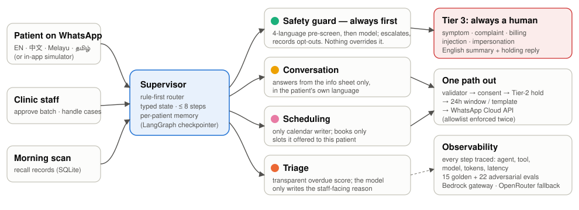

**Problem statement — Patient Follow-up.** Dental clinics maintain regular follow-up schedules for routine examinations, preventive care, and ongoing treatments. Staff manually review patient records to identify overdue appointments before contacting patients individually. As the patient database grows, maintaining consistent follow-up becomes increasingly difficult, resulting in missed appointments and delayed treatments.

**Live product:** `https://<LIVE_URL>` · **Code:** `<GITHUB_URL>` · **Demo video:** `<VIDEO_URL>`

## 1. The problem, in the clinic's words (Goal & scope)

*"We know who is overdue — it's all in the records. We just never have time to go through them, message everyone, answer the same questions and find a slot, while also running the front desk."* A two-to-three-dentist heartland clinic with a few thousand patients cannot give recall the attention it needs, so the patients who drift away quietly are the ones who get missed.

**Scope (deliberately narrow):** find overdue patients, reach them on WhatsApp in their own language, answer logistics from the clinic's own info sheet, book them into real free slots, and hand anything clinical or sensitive to a human. **Out of scope by design:** diagnosis, clinical advice, medication, billing disputes.

## 2. Who falls behind (Social impact)

* **Seniors.** 21.4% of Singapore citizens are now aged 65+, making Singapore a "super-aged" society [1].
* **Untreated disease follows the drift.** In the 2019 national adult oral health survey, 34.8% of adults had untreated dental caries, more often those aged 60+, of Malay ethnicity, living in 1–2-room public housing, and **those who only see a dentist when there is a problem** [2]. Only 53.9% of adults visit a dentist at least once a year, and 67% believe losing teeth is natural with age [3].
* **Subsidies alone don't bring people in.** Older Singaporeans eligible for subsidised care still report fear, anxiety and lack of knowledge as barriers; trust and convenience decide where they go [4] — even as CHAS now subsidises basic and preventive procedures such as scaling and polishing for more cardholders (from 1 Oct 2025) [5].
* **Language.** About half of residents speak a language other than English most at home (Mandarin 29.9%, Chinese dialects 8.7%, Malay 9.2%, Tamil 2.5%) [6], while 80.1% of Singapore internet users use WhatsApp every month [7].

**RecallCare's headline metrics are equity outcomes,** not message counts: overdue patients reached and rebooked, broken down by *overdue > 12 months, age 65+, non-English preference and CHAS cardholders*, plus symptoms caught and escalated that would otherwise have waited.

## 3. The solution: a small team of agents (Architecture)

{width=100%}

A **supervisor** routes each event (morning scan, staff approval, WhatsApp message) through four specialists, each with only the tools it needs: **Triage** ranks who is overdue with a transparent score and writes a reason per patient; the **Safety guard** screens *every* inbound message first; the **Conversation** agent answers in English, 中文, Bahasa Melayu or தமிழ் from the info sheet; the **Scheduling** agent is the only one allowed to touch the calendar. Built on LangGraph (typed state, checkpointed memory per patient, loop caps), FastAPI and SQLite on a single Amazon Lightsail instance, with the organisers' Bedrock-backed gateway as the model.

**Why agentic, not an SMS blast?** A blast sends one message and hopes. Evidence on one-way SMS reminders in dental services is mixed: one university clinic saw fail-to-attend odds fall 14% but cancellations rise [8]; a public service saw adult attendance rise from 73.5 to 77.7 per 100 appointments but not for children [9]. RecallCare closes the loop a blast cannot: it **reads the reply, answers the question that was stopping the patient, books the slot, and escalates the symptom** mentioned in passing ("can I come Friday, my gum has been bleeding for weeks").

## 4. Safe by design (Autonomy & HITL · Safety & guardrails)

| Tier | What happens | Examples |
|---|---|---|
| **1 · Autonomous** | Agents act and log it | overdue scan, ranking, logistics answers from the info sheet, booking an open slot, confirmations, one gentle re-nudge |
| **2 · Staff approve** | Nothing is sent until a person clicks | the daily outreach batch; every message to a patient flagged "sensitive" |
| **3 · Always a human** | Patient gets a warm holding reply ("…if this is an emergency, call 995"); case jumps to the top of the dashboard with an English summary | any symptom or medication question, complaint, billing, request for a person, prompt-injection or impersonation, low confidence |

Patient messages are treated as data, never instructions; a deterministic four-language pre-screen runs before any model, and the model can only *raise* a flag, never clear one. Tools are least-privilege and scoped in code to the current patient, so "list all patients" cannot succeed even if a model tried. Every outbound message passes a validator (right patient, allowlisted number, consent, no other patient's details, no clinical-advice pattern, only published prices, correct language). Opt-outs (STOP / 停止 / BERHENTI / நிறுத்து …) are honoured instantly and permanently.

## 5. Proof, not promises (Tool use · Observability & evaluation · Platform)

Every step is traced — which agent, which tool, which model, tokens and latency — and shown as a timeline in the dashboard. An evaluation suite replays **14 golden paths and 22 adversarial attacks** (prompt injection in four languages, role-play jailbreaks, hidden symptoms, requests for other patients' data, fake staff authority, 20-slot booking attempts, oversized and gibberish messages). **Latest results:** `<EVAL_LINE>` — safety invariants are checked on every scenario.

## 6. Business value (all inputs are labelled assumptions)

| Input | Value |
|---|---|
| Active patients; share overdue | 4,000; 40% → 1,600 overdue (**Assumption**, consistent with only 53.9% visiting yearly [3]) |
| Outreach capacity | 12 patients/day × 22 days = **264 contacted/month** (**Assumption**, the default batch size) |
| Manual effort avoided | 4 min per reminder + 6 min per booking conversation (**Assumption**) |
| Rebooking rate | 20% of contacted (**Assumption**; the synthetic demo is not evidence) |
| Value of a recovered visit | S$100 (**Assumption**, within the published ranges: check-up S$30–60 + scaling S$60–120) |
| Staff cost | S$18/hour (**Assumption**) |

**Per month:** 264 × 20% = **53 recovered visits ≈ S$5,300** revenue; staff time 264×4 + 53×6 = 1,374 min ≈ **23 hours ≈ S$410**; model cost `<COST_PER_CONVERSATION>` per conversation (measured) ≈ `<MONTHLY_LLM_COST>`. Even at a 5% rebooking rate the clinic recovers ~13 visits (≈ S$1,300) a month.

**Pricing (illustrative):** **S$149 per clinic per month** (up to 3 dentists, unlimited recall conversations) + WhatsApp message fees passed through at Meta's published rate. Onboarding is a configuration file, not a software project, and model spend is **capped in code** (a hard daily/total token budget), so an SME never gets a surprise bill.

## 7. Scale path and data protection

**Same agents, new clinic type — by configuration alone.** Every clinic rule lives in one YAML file (recall intervals, opening hours, info sheet, keyword lists, staff-time assumptions). A family GP clinic swaps in chronic-care reviews, vaccinations and screenings — the direction of Singapore's national preventive-care push, Healthier SG, under which residents enrol with a family doctor (enrolment began 5 July 2023) [10].

**PDPA-minded by default.** Only non-clinical fields reach the model (name, language, visit type, due date, bookings — never clinical notes); messages require a recorded WhatsApp consent flag; opt-outs are permanent; the dashboard is behind a login; secrets live only in server environment files; retention of conversation logs is configurable. Clinics should still confirm their own obligations with their Data Protection Officer. **This prototype uses synthetic data only.**

> **Rubric coverage.** 1 Goal & scope → §1–2 · 2 Architecture & reasoning loop → §3 · 3 Tool use & integration → §3, §5 · 4 Autonomy & HITL → §4 · 5 Safety & guardrails → §4 · 6 Observability & evaluation → §5 · 7 Platform & tooling → §3, §5 · Social impact → §2, §7 · Business value → §6.

### References
```{=typst}
#set text(size: 7.8pt)
#set par(spacing: 0.45em)
```

[1] National Population and Talent Division, *Population in Brief 2026* (released 25 Sep 2026), as reported by AsiaOne: <https://www.asiaone.com/singapore/singapore-super-aged-society-population-621-million-births-marriages-decline>

[2] Sim CPC, et al. Findings from the 2019 nationally representative oral health survey for adults in Singapore. *Community Dent Oral Epidemiol* 2024;52(3):281–291. <https://doi.org/10.1111/cdoe.12961>

[3] Wong ML, et al. Oral health knowledge, attitudes and behaviours of adults: findings from a National Oral Health Survey in Singapore. *Community Dent Oral Epidemiol* 2024;52(3):292–301. <https://doi.org/10.1111/cdoe.12947>

[4] Mittal R, et al. Factors affecting dental service utilisation among older Singaporeans eligible for subsidized dental care — a qualitative study. *BMC Public Health* 2019;19:1075. <https://doi.org/10.1186/s12889-019-7422-9>

[5] Ministry of Health Singapore, *Enhanced financing support for CHAS dental procedures…* (1 Sep 2025). <https://www.moh.gov.sg/newsroom/enhanced-financing-support-for-chas-dental-procedures-and-financial-governance-of-chas-clinics/>

[6] Singapore Department of Statistics, *Census of Population 2020 — Literacy & Home Language*. <https://www.singstat.gov.sg/files/5c62343f-d2e2-448b-b75f-0a7f865ac6e8.pdf>

[7] We Are Social & Meltwater, *Digital 2025: Singapore* (Feb 2025). <https://wearesocial.com/sg/blog/2025/02/digital-2025-top-digital-and-social-media-trends-in-singapore/>

[8] Storrs MJ, Ramov HM, Lalloo R. An investigation into patient non-attendance and use of a short-message reminder system at a university dental clinic. *J Dent Educ* 2016;80(1):30–39. PMID 26729682.

[9] Stormon N, et al. SMS reminders to improve outpatient attendance for public dental services: a retrospective study. *Health Soc Care Community* 2022;30(5):e2255–e2263. <https://doi.org/10.1111/hsc.13663>

[10] Ministry of Health Singapore, *Healthier SG enrolment programme to commence on 5 July* (2 Jul 2023). <https://www.moh.gov.sg/newsroom/healthier-sg-enrolment-programme-to-commence-on-5-july/>
